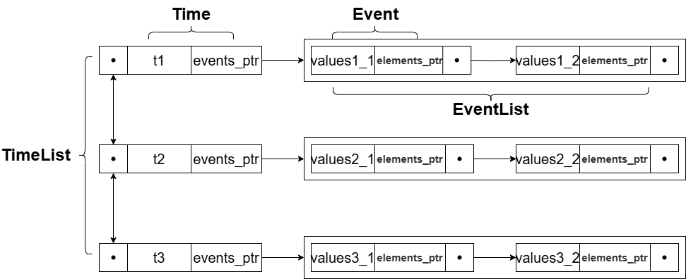

# 初级版本

## api

### <mark>MapNode<mark>

为结点，提供图的结构

#### T data

数据

#### vector< MapNode*> from_ptr

记录信号从哪来

#### vector<MapNode*> to_ptr

记录信号要去哪

#### <mark>Map<mark>

### <mark>Element<mark>

为某个接口

#### int value

为其值

#### Gate *gate

指向自己所在的Gate门

#### Element(int value=0)

构造函数

#### setValue()

设置自己的值

#### getValue()

获取自己的值

### <marK>Gate<mark>
门与各种元件的统称

#### vector< MapNode *> in

各个输入接口

#### vector< MapNode *> out

各个输出接口

#### enum

列举各接口名称

####  vector< vector< int>>  delay;

二维数组，描述了in到out的延迟

 #### virtual vector< int >  figureValue();

  计算各个out的值，返回一个temp表,记录信息，但不赋值

 ####  vector< bool > always();

  判断对应out的value与latestValue（调用latestValueGate（...））相比，是否发生了改变，返回一个bool数组

### <mark>Event<mark>

记录各个输入值的更改,更改亦有先后,通过List进行管理，组成EventList

#### vector<Element *> elements_ptr

记录更改的Element

#### vector< int > values

记录对应更改的值

### <mark>Time<mark>

为时间表，记录有驱动事件的时间，通过List进行管理

#### long long time

记录此时的时间

#### list< Event>* events_ptr

记录该时间的事件链

### <mark>ListNode<mark>

链表结点模版

#### T data

#### ListNode *next

#### ListNode *last

### <mark>List<mark>

为双向链表模版

#### ListNode *head

头结点

#### ListNode *tail

尾结点

#### push_back(T data)

#### push_front(T data)

#### insert_front()

#### insert_back()

#### print()

### <mark>全局函数<mark>

#### void update(EventNode& );

更新Element对应的值，Gate进行定值，与先前定值进行比较，判断是否需要修改(调用Gate::always())，如要修改，将修改的out，进行传递(调用transmit(...))，并在对应时间添加事件。

####void addEvent(long long time,MapNode & ,value );

添加Elment改变的value到time时的events上

#### int latestValueElement(MapNode &,long long start,long long end);

搜索latestValue在start到end最末端的值[start,end)

#### vector< int > latestValueGate(Gate &,long long start,long long end);

搜索Gate所有out的latestValue在start到end最末端的值[start,end)，返回一个数组。

#### void transmit(MapNode &，int delay);

将该Element的值通过Map进行传递（但并不改变末端的值），只是添加事件。

## 日志

### 2024.6.18

Gate类实现混乱，应当用MapNode作为其接口而不是Element，always()的if判断出了问题，可能是MapNode未写完。

figureValue与delay均未完成。

部分类忘记写构造函数。
